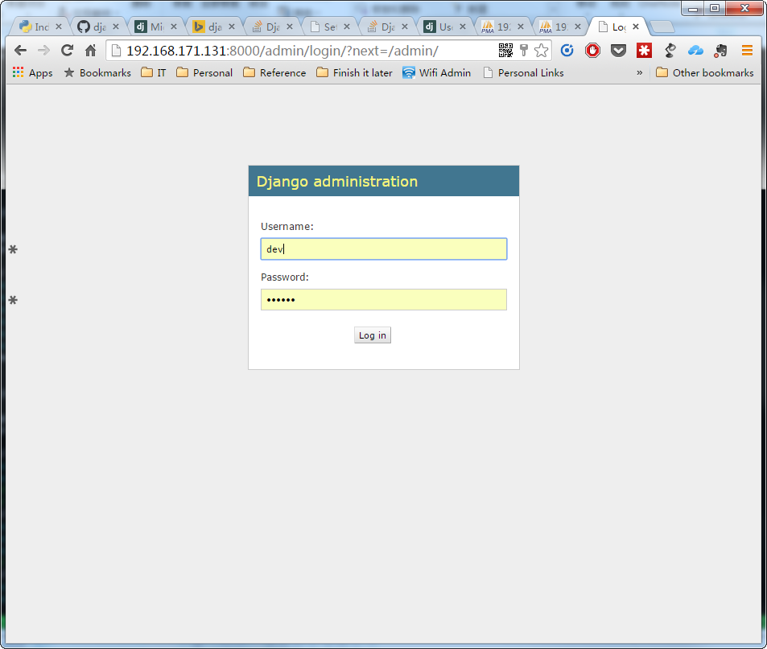
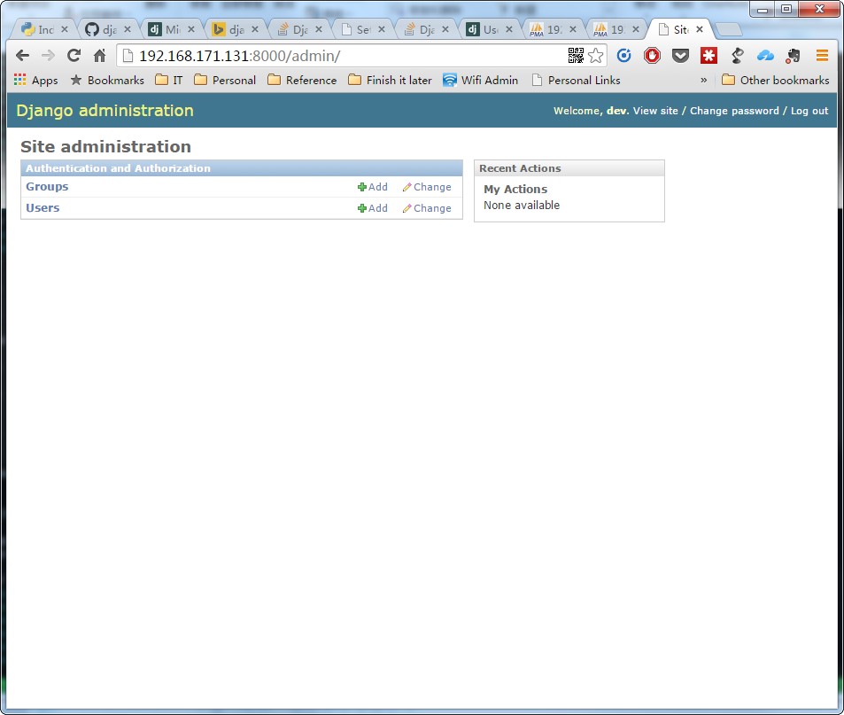
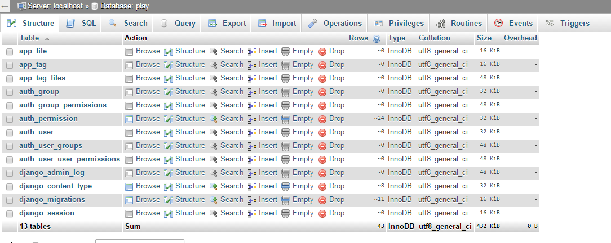

## Server name

linux-hwtf

## packages

- OpenSuSE 13.2
    + user: dev/dev123
    + packages:
        * git
        * python2.7
        * python3
        * pip
        * gcc
        * apache
        * mariadb
        * php
        * php-mbstring ext ...
        * samba
        * libmysqlclient-devel

## 服务管理

```bash
# 查询状态
linux-hwtf:/usr/lib/systemd/system # systemctl status apache2 mysql smb
apache2.service - The Apache Webserver
   Loaded: loaded (/usr/lib/systemd/system/apache2.service; disabled)
   Active: inactive (dead)


mysql.service - MySQL server
   Loaded: loaded (/usr/lib/systemd/system/mysql.service; disabled)
   Active: inactive (dead)

smb.service - Samba SMB Daemon
   Loaded: loaded (/usr/lib/systemd/system/smb.service; enabled)
   Active: active (running) since Tue 2015-09-08 08:07:37 CST; 14min ago
 Main PID: 12923 (smbd)
   Status: "smbd: ready to serve connections..."
   CGroup: /system.slice/smb.service
           ├─12923 /usr/sbin/smbd -D
           ├─12926 /usr/sbin/smbd -D
           └─16178 /usr/sbin/smbd -D

# 开机启动
systemctl enable apache2 
systemctl enable mysql
# start stop
systemctl start apache2 
systemctl start mysql
systemctl stop apache2 
systemctl stop mysql
```

## apache

配置文件位于`/etc/apache2/`
当前配置下`DocumentRoot "/srv/www/htdocs"`

## mysql
配置文件位于`/etc/my.conf`

- listen on 3306
- root password = mysqlroot
- change password with command
- `mysqladmin -u root --password=<old passwd> password <new password>`
- can be managed at http://linux-hwtf/phpMyAdmin/

## git
  
customize your git by editing ~dev/.gitconfig

```
[user]
      name = isaac
      email = isaac@163.com
```
  
remove following section if you aren't using git behind proxy

```
[http]
        proxy = http://10.128.7.50:3128
```

## samba

用户dev的密码dev123

```
# 新建samba用户 
linux-hwtf:/etc/samba # smbpasswd -a dev
New SMB password:
Retype new SMB password:
Added user dev.

# 更改密码
dev@linux-hwtf:~> smbpasswd
Old SMB password:
New SMB password:
Retype new SMB password:
Password changed for user dev
```

## pip 

pip 是python 的包管理工具
通常使用pip install <package> 安装python 包, 为了防止重复下载和备份重要的包, 建议先下载包

```
pip install --download <path_to_store_package> <package name>
如
pip install --download /home/dev/packages/pip Django==1.8.4
```

再使用下载的包安装

```
pip install --no-index --find-links="file:<path_to_store_package>" <package name>
如
pip install --no-index --find-links="file:/home/dev/packages/pip" Django
pip install --no-index --find-links="file:/home/dev/packages/pip" MySQL-python
```

## django doc

[django doc](http://linux-hwtf/django-docs)

## django initialization

创建python 虚拟环境, 第三方包将会安装在此虚拟环境中

```
dev@linux-hwtf:~> virtualenv -p python2.7 venv
Running virtualenv with interpreter /usr/bin/python2.7
New python executable in venv/bin/python2.7
Also creating executable in venv/bin/python
Installing setuptools, pip, wheel...done.
dev@linux-hwtf:~> ls
bin  docs  packages  venv
```
初始化环境变量,启动该虚拟环境

```
dev@linux-hwtf:~> bash
dev@linux-hwtf:~> . venv/bin/activate
```
安装Django MySQL-python包. 由于在虚拟环境中,包会安装到 `~/venv/lib/`中

```
(venv)dev@linux-hwtf:~> pip install --no-index --find-links="packages/pip/" Django MySQL-python
Ignoring indexes: https://pypi.python.org/simple
Collecting Django
Collecting MySQL-python
Installing collected packages: Django, MySQL-python
Successfully installed Django-1.8.4 MySQL-python-1.2.5
```
创建django项目

```
(venv)dev@linux-hwtf:~> django-admin startproject website
(venv)dev@linux-hwtf:~> cd website/
(venv)dev@linux-hwtf:~/website> ls
manage.py  website
```

修改setting.py 将数据库指向本地mysql数据库. mcms数据库应提前在(http://linux-hwtf/phpMyAdmin/)中创建好.

```
(venv)dev@linux-hwtf:~/website> vi website/settings.py

+ DATABASES = {
+     'default': {
+         'ENGINE': 'django.db.backends.mysql',
+         'NAME': 'mcms',
+         'USER': 'mcms',
+         'PASSWORD': 'NaS2ESQ2b8uDTebc',
+         'HOST': '127.0.0.1',
+     }
+ }
```

安装auth/admin/session等模块的数据库表
```
(venv)dev@linux-hwtf:~/website> ./manage.py migrate
Operations to perform:
  Synchronize unmigrated apps: staticfiles, messages
  Apply all migrations: admin, contenttypes, auth, sessions
Synchronizing apps without migrations:
  Creating tables...
    Running deferred SQL...
  Installing custom SQL...
Running migrations:
  Rendering model states... DONE
  Applying contenttypes.0001_initial... OK
  Applying auth.0001_initial... OK
  Applying admin.0001_initial... OK
  Applying contenttypes.0002_remove_content_type_name... OK
  Applying auth.0002_alter_permission_name_max_length... OK
  Applying auth.0003_alter_user_email_max_length... OK
  Applying auth.0004_alter_user_username_opts... OK
  Applying auth.0005_alter_user_last_login_null... OK
  Applying auth.0006_require_contenttypes_0002... OK
  Applying sessions.0001_initial... OK
(venv)dev@linux-hwtf:~/website> ./manage.py createsuperuser
Username (leave blank to use 'dev'):
Email address:
Password:
Password (again):
Superuser created successfully.
(venv)dev@linux-hwtf:~/website> ./manage.py runserver 0.0.0.0:8000
Performing system checks...

System check identified no issues (0 silenced).
September 08, 2015 - 06:16:51
Django version 1.8.4, using settings 'website.settings'
Starting development server at http://0.0.0.0:8000/
Quit the server with CONTROL-C.
```


visit `http://linux-hwtf:8000/admin/` for administration




```
(venv)dev@linux-hwtf:~/website> ./manage.py startapp mcms
(venv)dev@linux-hwtf:~/website> vi website/settings.py
```

add mcms to INSTALL_APPS

```python
INSTALLED_APPS = (
    'django.contrib.admin',
    'django.contrib.auth',
    'django.contrib.contenttypes',
    'django.contrib.sessions',
    'django.contrib.messages',
    'django.contrib.staticfiles',
    'mcms',
)
```


## test project 

```
(venv)dev@linux-hwtf:~> django-admin startproject play
(venv)dev@linux-hwtf:~> ls
bin  docs  packages  play  venv  website
(venv)dev@linux-hwtf:~> cd play/
(venv)dev@linux-hwtf:~/play> ls
manage.py  play
(venv)dev@linux-hwtf:~/play> vi play/settings.py
# add database info into setting.py
# DATABASES = {
#     'default': {
#         'ENGINE': 'django.db.backends.mysql',
#         'NAME': 'mcms',
#         'USER': 'mcms',
#         'PASSWORD': 'NaS2ESQ2b8uDTebc',
#         'HOST': '127.0.0.1',
#     }
# }
(venv)dev@linux-hwtf:~/play> ./manage.py migrate
Operations to perform:
  Synchronize unmigrated apps: staticfiles, messages
  Apply all migrations: admin, contenttypes, auth, sessions
Synchronizing apps without migrations:
  Creating tables...
    Running deferred SQL...
  Installing custom SQL...
Running migrations:
  Rendering model states... DONE
  Applying contenttypes.0001_initial... OK
  Applying auth.0001_initial... OK
  Applying admin.0001_initial... OK
  Applying contenttypes.0002_remove_content_type_name... OK
  Applying auth.0002_alter_permission_name_max_length... OK
  Applying auth.0003_alter_user_email_max_length... OK
  Applying auth.0004_alter_user_username_opts... OK
  Applying auth.0005_alter_user_last_login_null... OK
  Applying auth.0006_require_contenttypes_0002... OK
  Applying sessions.0001_initial... OK
(venv)dev@linux-hwtf:~/play> ls
manage.py  play
(venv)dev@linux-hwtf:~/play> ./manage.py startapp app
(venv)dev@linux-hwtf:~/play> vi play/settings.py
# add app into INSTALL_APP
# INSTALLED_APPS = (
#     'django.contrib.admin',
#     'django.contrib.auth',
#     'django.contrib.contenttypes',
#     'django.contrib.sessions',
#     'django.contrib.messages',
#     'django.contrib.staticfiles',
#     'mcms',
# )
(venv)dev@linux-hwtf:~/play> cd app/
(venv)dev@linux-hwtf:~/play/app> ls
admin.py  __init__.py  migrations  models.py  tests.py  views.py
# 编辑models.py
(venv)dev@linux-hwtf:~/play/app> cat models.py
from django.db import models

# Create your models here.

class File(models.Model):
    name = models.TextField(blank=True, null=True)
    sha256sum = models.TextField(blank=True, null=True)

class Tag(models.Model):
    text = models.TextField(blank=False, null=False)
    files = models.ManyToManyField(File)

(venv)dev@linux-hwtf:~/play/app> ls migrations/
__init__.py
(venv)dev@linux-hwtf:~/play/app> cd ..
(venv)dev@linux-hwtf:~/play> ls
app  manage.py  play
(venv)dev@linux-hwtf:~/play> ./manage.py makemigrations
Migrations for 'app':
  0001_initial.py:
    - Create model File
    - Create model Tag
(venv)dev@linux-hwtf:~/play> ./manage.py sqlmigrate
usage: manage.py sqlmigrate [-h] [--version] [-v {0,1,2,3}]
                            [--settings SETTINGS] [--pythonpath PYTHONPATH]
                            [--traceback] [--no-color] [--database DATABASE]
                            [--backwards]
                            app_label migration_name
manage.py sqlmigrate: error: too few arguments
```
check sqls

```
(venv)dev@linux-hwtf:~/play> ./manage.py sqlmigrate app 0001
BEGIN;
CREATE TABLE `app_file` (`id` integer AUTO_INCREMENT NOT NULL PRIMARY KEY, `name` longtext NULL, `sha256sum` longtext NULL);
CREATE TABLE `app_tag` (`id` integer AUTO_INCREMENT NOT NULL PRIMARY KEY, `text` longtext NOT NULL);
CREATE TABLE `app_tag_files` (`id` integer AUTO_INCREMENT NOT NULL PRIMARY KEY, `tag_id` integer NOT NULL, `file_id` integer NOT NULL, UNIQUE (`tag_id`, `file_id`));
ALTER TABLE `app_tag_files` ADD CONSTRAINT `app_tag_files_tag_id_6001ac54_fk_app_tag_id` FOREIGN KEY (`tag_id`) REFERENCES `app_tag` (`id`);
ALTER TABLE `app_tag_files` ADD CONSTRAINT `app_tag_files_file_id_3ed77527_fk_app_file_id` FOREIGN KEY (`file_id`) REFERENCES `app_file` (`id`);

COMMIT;
(venv)dev@linux-hwtf:~/play> ./manage.py migrate
Operations to perform:
  Synchronize unmigrated apps: staticfiles, messages
  Apply all migrations: admin, app, contenttypes, auth, sessions
Synchronizing apps without migrations:
  Creating tables...
    Running deferred SQL...
  Installing custom SQL...
Running migrations:
  Rendering model states... DONE
  Applying app.0001_initial... OK
(venv)dev@linux-hwtf:~/play>
```

表被创建


## django login

http://solutoire.com/2009/02/26/django-series-1-a-custom-login-page/